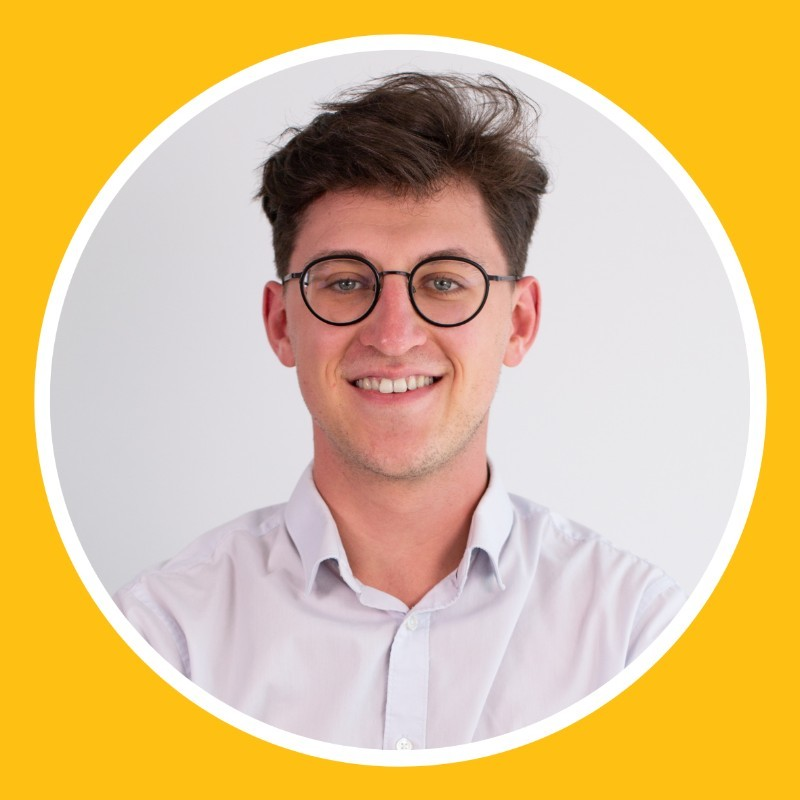
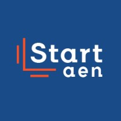
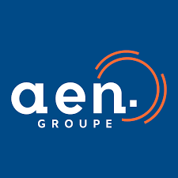
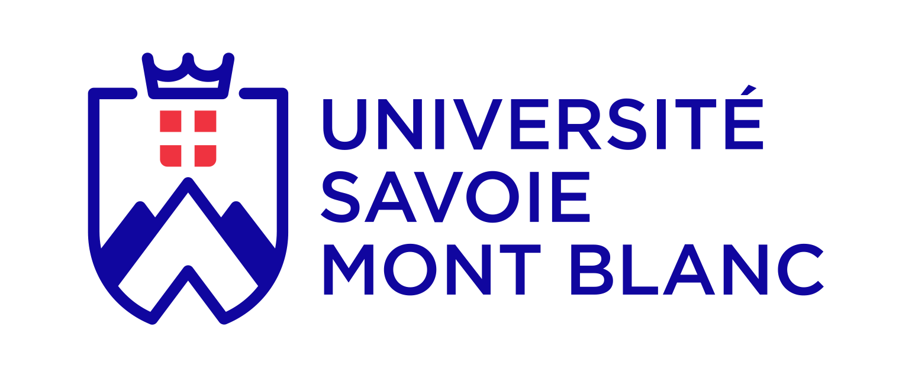
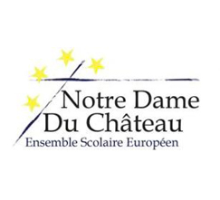

# À propos de moi

## Qui suis-je ?

**Ma passion pour les nouvelles technologies** et **ma curiosité** me poussent constamment à explorer de nouveaux 
horizons, à acquérir de nouvelles connaissances et à trouver des moyens de les partager. Cette **soif de découverte**
et de **développement personnel** est fondamentale pour mon épanouissement, à la fois sur le plan professionnel et 
personnel.

Je ne me suis découvert une passion pour l'informatique que très tardivement. En effet, après un bac économique et 
social, j'ai commencé une licence de maths et économie appliquée aux sciences humaines et sociales. Cependant, je me 
suis vite rendu compte que ce domaine ne me correspondait pas. À travers cette licence, j'ai découvert l'informatique 
et j'ai alors décidé de me réorienter vers ce domaine. J'ai ainsi commencé à m'intéresser à ce domaine en 2018, lors de
ma première année à INTECH. J'ai découvert un univers qui me correspondait parfaitement. J'ai pu développer 
des **compétences techniques**, mais également des **compétences transverses**, qui me sont utiles dans la vie 
professionnelle.

En tant qu’**Expert en Ingénierie du Logiciel**, j’ai appris à m’organiser, à être à l’aise à l’oral et à 
travailler en équipe. Mon projet personnel est de travailler dans le domaine du DevOps, car j’aimerais avoir les 
moyens de développer des solutions efficaces et durables.

## Mon parcours
|                                                                                                                                                                               |                                                                                                                                                                                                                                                                                                                                                                                                                                                                                                                                                                                                                                                                                                                                                                                                                                                                                                                                                                                                                                                          |
|-------------------------------------------------------------------------------------------------------------------------------------------------------------------------------|----------------------------------------------------------------------------------------------------------------------------------------------------------------------------------------------------------------------------------------------------------------------------------------------------------------------------------------------------------------------------------------------------------------------------------------------------------------------------------------------------------------------------------------------------------------------------------------------------------------------------------------------------------------------------------------------------------------------------------------------------------------------------------------------------------------------------------------------------------------------------------------------------------------------------------------------------------------------------------------------------------------------------------------------------------|
| <a href="https://itesoft.com/" target="_blank"> 2021 - aujourd'hui</a>               | **iTESOFT**    ___Project Engineer Executive___   𝗠𝗶𝘀𝘀𝗶𝗼𝗻 : Participation à l’ensemble des phases de réalisation des projets clients RAD/LAD en France et à l’international :   - Études fonctionnelles et techniques,   - Développement et paramétrage,   - Tests et intégration,   - Mise en œuvre opérationnelle in situ.   → Docker, NodeJS, JavaScript, Java, RAD/LAD, Git    ___Stagiaire___   𝗠𝗶𝘀𝘀𝗶𝗼𝗻 : Réalisation d’un module d’installation automatisé des produits.   → Bash, Docker, Git                                                                                                                                                                                                                                                                                                                                                                                                                                                                                   |
| <a href="https://www.groupe-aen.info/" target="_blank"> 2019 - 2020</a>          | **START IN'TECH**    ___Vice-président___   Responsable de la structure sur le campus de Nîmes Métropole.   Prospection, analyse des besoins, négociation et rédaction d'offres, suivi des projets, gestion des ressources humaines (contrats de travail, DPAE, fiches de paie ...).    ___Développeur junior___   Projet : ESSentiel   𝗠𝗶𝘀𝘀𝗶𝗼𝗻 : Développement d'une plateforme collaborative de cartographie des structures ESS (Économie Sociale et Solidaire) de la région Nouvelle-Aquitaine.   → Spring Boot, Angular, Docker, CI/CD   Projet : [PingScore](./mes-réalisations/pingscore)   𝗠𝗶𝘀𝘀𝗶𝗼𝗻 : Refactorisation, développement et déploiement de nouvelles fonctionnalités majeurs pour une application web.   → Spring Boot, Server-Sent Events, Angular, Docker, CI/CD                                                                                                                                                                                                   |
| <a href="https://www.groupe-aen.info/" target="_blank"> 2018 - 2023</a>         | **GROUPE AEN - INTECH**   ___Expert en ingénierie du logiciel - RNCP niveau 1___    La pédagogie de la formation INTECH proposée par le [Groupe AEN](https://www.groupe-aen.info/){:target="_blank"} a été mon critère de choix pour cette école.   Chaque semestre, nous réalisons :   👨🏻‍💻 𝟷 ᴘʀᴏᴊᴇᴛ ɪɴғᴏʀᴍᴀᴛɪǫᴜᴇ : pour développer les compétences techniques (algorithmie, base de données, conception orientée objet, virtualisation, ... ).   👨🏻‍🎓 𝟷 ᴘʀᴏᴊᴇᴛ ᴅᴇ ғᴏʀᴍᴀᴛɪᴏɴ ʜᴜᴍᴀɪɴᴇ : pour développer toutes les compétences transverses qui pourront nous aider dans notre futur vie professionnelle (technique de vente, gestion de budget, logistique, communication, ... ).   Ces deux projets réalisés en partenariat direct avec des entreprises du territoire sont très enrichissant sur le plan technique et personnel. Rien à voir avec les cas d'étude au tableau de l'université. Nous devons nous confronter à de vraies personnes, de vraies situations et de vraies problématiques.  |
| <a href="https://www.savoie-mont-blanc.com/" target="_blank"> 2017 - 2018</a> | **Université Savoie Mont Blanc**   ___L1 Mathématiques et Informatique appliquées aux sciences humaines et sociales___   Réorientation après la L1.   Cette année à l'université m'a offert la possibilité d'enrichir et d'approfondir un domaine que j’apprécie, mais dans lequel je n'ai pas réussi à me projeter. Ce qui m'a décidé à me réorienter.  Elle m'a toutefois permis d'acquérir de solides bases en comptabilité financière, gestion d'entreprise, marketing, microéconomie et macroéconomie.                                                                                                                                                                                                                                                                                                                                                                                                                                                                                                                      |
| <a href="https://ndchateau.com/" target="_blank"> 2014 - 2017</a>                 | **Lycée Européen Notre Dame du Château**   ___Baccalauréat général, série économique et sociale spécialité sciences politiques___                                                                                                                                                                                                                                                                                                                                                                                                                                                                                                                                                                                                                                                                                                                                                                                                                                                                                                                    |

## Contact
|                                                                                                                                                                                                                        |                                                                                                                                                                                                                      |                                                                                                                                                                                                         |
|------------------------------------------------------------------------------------------------------------------------------------------------------------------------------------------------------------------------|----------------------------------------------------------------------------------------------------------------------------------------------------------------------------------------------------------------------|---------------------------------------------------------------------------------------------------------------------------------------------------------------------------------------------------------|
| <a style="margin-left:58px" href="https://www.linkedin.com/in/luc-nicolas/" target=”_blank”>luc-nicolas</a> | <a style="margin-left:58px" href="mailto:l.nicolas@groupe-aen.info" target=”_blank”>l.nicolas@groupe-aen.info</a> | <a style="margin-left:58px" href="https://github.com/lucnicolas/" target=”_blank”>lucnicolas</a> |                       |

