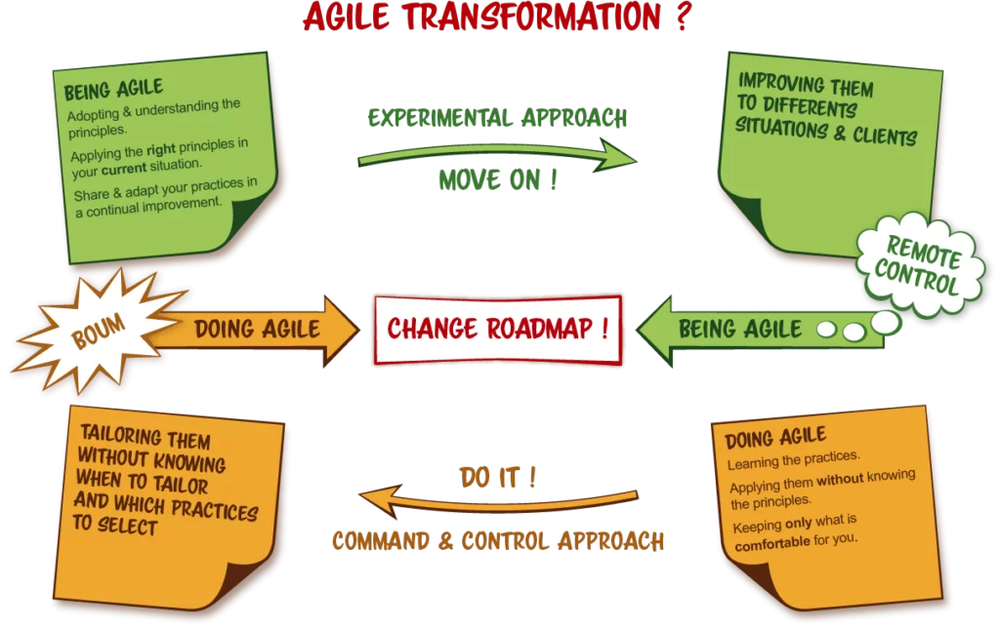

# Analyse du besoin client

## Contexte

Comprendre les besoins et les attentes des clients est une **compétence essentielle** pour les professionnels évoluant dans
le domaine de l'ingénierie logicielle. Cette compétence implique de mener une **analyse approfondie** afin de concevoir des
solutions personnalisées qui **répondent parfaitement aux besoins des clients**.

Dans un monde en constante évolution, il est crucial de rester à l'écoute des besoins changeants des clients et des
utilisateurs finaux. Les entreprises doivent donc s'adapter rapidement pour répondre à ces
nouvelles réalités, que ce soit en termes de travail à distance, de consommation en ligne ou d'autres changements
majeurs.

Par ailleurs, l'analyse des besoins est désormais étroitement liée aux principes du développement durable et de 
[la responsabilité sociétale des entreprises](https://www.insee.fr/fr/statistiques/1281346). Les entreprises aspirent à  
comprendre et à répondre de manière éthique et
durable aux besoins de toutes les parties prenantes, qu'il s'agisse des clients, des employés ou des communautés
locales.

Aujourd'hui, la maîtrise de l'analyse des besoins clients est devenue indispensable, notamment dans les domaines de
l'informatique et du numérique. Les entreprises qui réussissent sont celles qui parviennent à concevoir des solutions
innovantes qui répondent réellement aux besoins des clients.

## Mes expériences

1. Dans le cadre de mon travail à iTESOFT, j'ai l'occasion de mettre en place cette compétence très régulièrement sur
   des [projets clients](../../../mes-réalisations/projets-itesoft). Par exemple, récemment, j'ai travaillé sur un projet avec un client important. Au début du
   projet, pour cadrer correctement les besoins du client, j'ai organisé des ateliers avec les utilisateurs finaux pour
   comprendre leurs besoins et leurs attentes en matière de fonctionnalités. Puis au cours du projet, j'ai organisé des
   sessions de présentation et de test du produit par les utilisateurs finaux. Les remarques et commentaires ont été
   intégrés dans les développements au cours du projet et le résultat final a été largement apprécié par les
   utilisateurs. Cette méthodologie a permis de s'assurer que le produit développé répondait parfaitement aux
   besoins du client.
   
2. Au cours de ma formation à INTECH, j'ai réalisé plusieurs projets en équipe pour des entreprises ou des associations
   qui cherchaient à développer une application. Par exemple sur le projet [PingScore](../../../mes-réalisations/pingscore) en
   tant que chef de projet, je me suis concentré sur cet aspect d'analyse du besoin. J'ai commencé par rencontrer le
   commanditaire pour discuter de ses besoins et de ses attentes pour l'application. J'ai posé des questions détaillées
   pour comprendre le public cible, les fonctionnalités, les préférences de conception et les délais. Après avoir
   recueilli toutes les informations nécessaires, avec mon équipe, nous avons créé un document détaillé de
   spécifications fonctionnelles pour le site web. Au cours du projet j'ai organisé plusieurs séances d'échanges et de
   démonstration avec les utilisateurs finaux pour valider les développements et définir les priorités. C'est grâce à
   ces discussions et cette étape d'analyse, que l'application conçue répondait parfaitement au besoin du commanditaire.

## Mon niveau d’acquisition de la compétence

**J'ai acquis une expérience solide dans l'analyse du besoin client** en travaillant sur divers projets tout au long de ma
formation et de mon alternance. J'ai appris à **poser les bonnes questions** pour comprendre les besoins et les attentes des
clients, à **identifier les exigences clés** et à les **traduire en spécifications fonctionnelles**. J'ai également 
appris à
travailler en étroite collaboration avec les clients pour m'assurer que les solutions développées répondent à leurs
attentes.

## Conseil

En fin de compte, pour analyser correctement les besoins d'un client, il est important de **rester à l'écoute**, de **poser
des questions** et de **prendre en compte les commentaires** et les réactions des clients tout au long du processus. Cela
permettra de créer des solutions qui répondent réellement aux besoins des clients et qui sont susceptibles de recevoir
un accueil favorable. En outre, il est essentiel de continuer à **se former** et à **se tenir informé** des tendances et des
évolutions dans le domaine de l'analyse des besoins client, en assistant à des conférences, en lisant des blogs et en
échangeant avec d'autres professionnels du secteur.

Pour aller plus loin :

- [Les 10 outils de base](https://khorum.com/10-outils-d-analyse-du-besoin-projet/){:target="_blank"}

## Projets liés

- [PingScore](../../../mes-réalisations/pingscore)
- [WorkBoard](../../../mes-réalisations/workboard)
