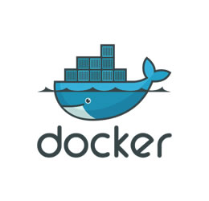

# Docker

## Contexte

[Docker](https://www.docker.com/){:target="_blank"} est une **technologie de conteneurisation** qui permet de créer des
conteneurs isolés pour exécuter des applications de manière fiable et cohérente sur différents environnements. La
conteneurisation est un principe qui vise à **isoler les processus d'une machine**, chaque applicatif fonctionnant 
dans son propre micro-système afin de ne pas dépendre d'autres composants.

Contrairement à la virtualisation, qui émule un ordinateur complet, la conteneurisation ne fait fonctionner que la
partie logicielle nécessaire et peut interagir directement avec le noyau de la machine, ce qui la rend plus légère que
la virtualisation. Cela en fait un choix idéal pour isoler des applications uniques sur un système plus complet.

Docker a été créé en 2013 par Solomon Hykes lors d'un hackathon interne
chez [dotCloud](https://www.docker.com/press-release/dotcloud-inc-now-docker-inc/){:target="_blank"}, une entreprise
de [PaaS](https://azure.microsoft.com/fr-ca/resources/cloud-computing-dictionary/what-is-paas){:target="_blank"}. Hykes
a créé Docker pour résoudre un problème de déploiement de code chez dotCloud, mais la technologie a rapidement attiré
l'attention de la communauté open-source et a depuis connu un succès mondial.

Il est devenu un outil de conteneurisation très populaire dans le monde de l'informatique. Depuis sa création
en 2013, Docker a révolutionné la façon dont les applications sont déployées sur des infrastructures à grande échelle.

Récemment le lancement de [Docker Enterprise 3.1](https://www.docker.com/products/docker-enterprise){:target="_blank"}, 
a dernière version de leur plateforme de conteneurs d'entreprise a été annoncé. Cette version 
est conçue pour faciliter la mise en place d'une infrastructure de conteneurs en entreprise et répondre aux besoins 
spécifiques des grandes organisations.

Dans le contexte des entreprises, Docker est largement utilisé pour différentes applications, notamment la
virtualisation de serveurs, la création de plateformes d'applications, et la mise en place de pipelines de livraison
continue. De plus en plus d'entreprises utilisent Docker pour **accélérer la mise en production de leurs applications** 
tout en **réduisant les coûts et les risques associés**.

Il est également utilisé dans le domaine de l'
[Internet des objets (IoT)](https://www.ovhcloud.com/fr/learn/what-is-iot/){:target="_blank"}. La conteneurisation 
permet de déployer des applications IoT de manière plus efficace et sécurisée en isolant les applications les unes 
des autres et en assurant une meilleure gestion des ressources.

Enfin, Docker est de plus en plus utilisé dans le **domaine de l'apprentissage automatique (machine learning)** et de
**l'intelligence artificielle (IA)**. La conteneurisation permet de déployer facilement des modèles d'apprentissage
automatique et de les exécuter sur des infrastructures à grande échelle.

## Mes expériences

1. Lorsque j'ai travaillé en tant que développeur pour une entreprise de logiciels de grande envergure, j'ai été chargé
   de migrer une application monolithique vers une architecture de microservices. Bien que ce soit une tâche complexe,
   j'ai réussi à simplifier le processus en utilisant Docker pour créer des conteneurs légers et portables pour chaque
   microservice. Non seulement cela a permis à l'application de fonctionner de manière plus efficace, mais cela a
   également permis une gestion plus facile des mises à jour et des déploiements de nouvelles fonctionnalités.
2. Lorsque j'ai été confronté à un problème de compatibilité entre différentes versions de bibliothèques utilisées par
   mon application, j'ai eu recours à Docker pour résoudre ce problème. En créant des images Docker contenant des
   versions spécifiques de chaque bibliothèque, j'ai pu isoler chaque composant de l'application dans son propre
   conteneur. Cela m'a permis de tester rapidement différentes configurations de bibliothèques sans risquer de corrompre
   l'ensemble de l'application. En fin de compte, cette approche a permis de résoudre le problème de compatibilité de
   manière efficace et rapide.

## Mon niveau d’acquisition de la compétence

En ce qui me concerne, j'ai acquis une forte expertise en Docker grâce à mon travail chez iTESOFT. Nous utilisons Docker
pour déployer nos produits chez les clients, ce qui nous permet de les personnaliser rapidement et efficacement. J'ai
également utilisé Docker dans des projets personnels pour créer des environnements de développement cohérents.

## Conseil

Si je devais donner un conseil à quelqu'un qui découvre la conteneurisation avec Docker, je lui conseillerais de bien
comprendre la différence entre la conteneurisation et la virtualisation. Dans la virtualisation, le système
d'exploitation est totalement indépendant de la machine hôte, tandis qu'avec la conteneurisation, le système
d'exploitation est partagé entre l'hôte et le conteneur.

Ensuite, je lui conseillerais de toujours créer un conteneur pour chaque "service" ou processus de son application. Cela
permet de mieux gérer les dépendances entre les différents services et de les mettre à jour ou de les répliquer plus
facilement.

Pour aller plus loin :

- [Une présentation de Docker par Solomon Hykes](https://www.youtube.com/watch?v=Q5POuMHxW-0){:target="_blank"}
- [La documentation officielle Docker](https://docs.docker.com/){:target="_blank"}

## Projets liés

- [PingScore](../../../mes-réalisations/pingscore)
- [Toolkit Delivery](../../../mes-réalisations/toolkit-delivery)
