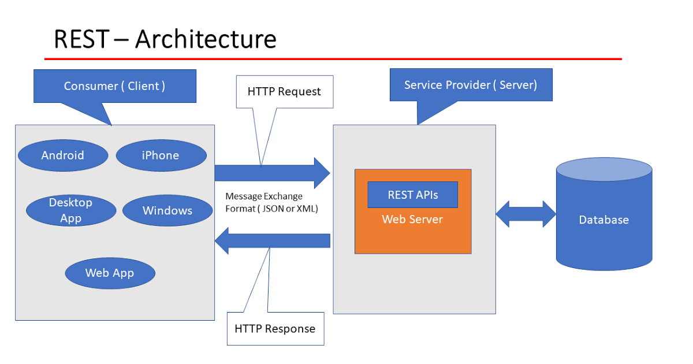

# BB5SCORE

## Le contexte
À la suite du projet PingScore, j'ai été contacté par le manager de l'Équipe de France de [Baseball Five](https://baseball5.wbsc.org/fr.html){:target="_blank"} Lahcène 
Benhamida pour un nouveau projet.

Pratique sportive fraichement arrivée en France, le Baseball Five est une variante du baseball traditionnel qui se joue à cinq joueurs de chaque côté. Le Baseball Five a été développé pour être une version plus rapide et plus accessible du baseball, adaptée aux espaces urbains et aux terrains de petite taille.

Chargé de mission sur le développement de cette pratique par la [Fédération Française de Baseball et Softball (FFBS)](https://ffbs.fr/){:target="_blank"}, Lahcène Benhamida cherchait à développer un outil moderne et intuitif pour faciliter l'organisation et la 
gestion de compétitions de Baseball Five.
Après avoir vu le travail réalisé par Hugo Marti et moi-même pour le compte de l'[ASPCN](http://aspcn.fr/){:target="_blank"} sur le projet [PingScore](../pingscore){:target="_blank"}, 
la FFBS a décidé de me contacter pour que je réalise une application prototype.

## Les objectifs
Plusieurs sessions d'échange ont été organisé avec la Fédération pour permettre d'identifier le besoin.
À la suite de cela 3 objectifs ont été fixés à l'application BB5SCORE :

1.	Créer une plateforme en ligne pour gérer les inscriptions des équipes et des joueurs pour des tournois de Baseball Five.
2.	Fournir un système de gestion des matchs et des scores, permettant aux organisateurs de suivre les résultats en temps réel.
3.	Offrir une interface conviviale pour les joueurs et les spectateurs, leur permettant de consulter les horaires, les scores et les classements.

## Les étapes de réalisation
Le développement de BB5SCORE s'est déroulé en plusieurs étapes clés :

1. **Analyse des besoins :** J'ai travaillé en étroite collaboration avec les responsables de tournois de Baseball Five 
pour comprendre leurs attentes et leurs besoins spécifiques.

2. **Conception de l'architecture :** J'ai défini une architecture solide pour l'application, en utilisant les meilleures 
   pratiques de développement logiciel que j'avais à ma connaissance. L'application est basée sur une [architecture REST](https://www.redhat.com/fr/topics/api/what-is-a-rest-api){:target="_blank"} avec un [client Angular](https://angular.io/){:target="_blank"}, un [serveur Spring Boot](https://spring.io/){:target="_blank"} s'occupant de 
   toute la logique ainsi que de la communication avec la base de données et un serveur [Mercure](https://mercure.rocks/){:target="_blank"} pour gérer les mises à jour en temps réel.

3. **Développement des fonctionnalités :** J'ai ensuite développé les fonctionnalités essentielles, telles que la gestion 
   des inscriptions, la création des calendriers de matchs, la saisie des scores et la génération automatique des classements. Lors de la phase de développement, j'ai créé un groupe avec plusieurs personnes de la FFBS ainsi que des joueurs de Baseball Five. Chaque nouvelle fonctionnalité développée était déployée en ligne pour permettre à ce groupe de tester et de valider le fonctionnement de l'application.
4. **Tests et corrections :** Une fois l'ensemble des fonctionnalités développé, nous avons effectué des tests approfondis 
   pour garantir le bon fonctionnement de l'application. Cette phase à permis d'apporter un certain nombre d'ajustements et de corrections nécessaires.
5. **Déploiement et maintenance :** J'ai ensuite déployé l'application publiquement sur une plateforme en ligne sécurisée 
   à l'occasion d'une rencontre de Baseball Five au CREPS de Montpellier en juin 2021.

## Les résultats présents et futurs
L'application BB5SCORE a été utilisé sur plusieurs rencontres de Baseball Five en France courant 2020. Elle a permis de centraliser les inscriptions des équipes, de créer les calendriers de matchs, de saisir les scores en temps réel et de générer automatiquement les classements. La FFBS a été très satisfaite de l'application qui a été promu lors de l'Open de France de Baseball Five 2020.

Toutefois, avec le développement de ce sport en France et à l'international, la [Confédération Mondiale de Baseball et Softball (WBSC)](https://baseball5.wbsc.org/fr.html){:target="_blank"} a également proposé une application similaire qui a été adopté par plusieurs autres pays. Dans un souci d'harmonisation, l'application BB5SCORE a été abandonné pour la FFBS en 2023.

BB5SCORE a été une réalisation gratifiante qui démontre ma capacité à contribuer à des projets de développement d'applications performantes et à répondre aux besoins spécifiques des clients.

## Compétences liées
- [Adapation](../../mes-compétences/Humaines/adaptation)
- [Analyse du besoin](../../mes-compétences/Humaines/analyse-du-besoin)
- [Déploiement automatisé](../../mes-compétences/Techniques/deploiement-automatise)
- [Planification](../../mes-compétences/Techniques/planification)
- [Docker](../../mes-compétences/Techniques/docker)
- [Développement de logiciel](../../mes-compétences/Techniques/developpement-logiciel)
