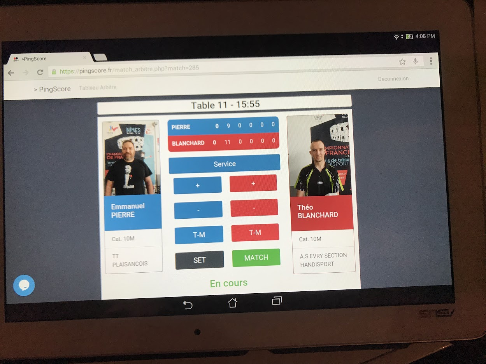
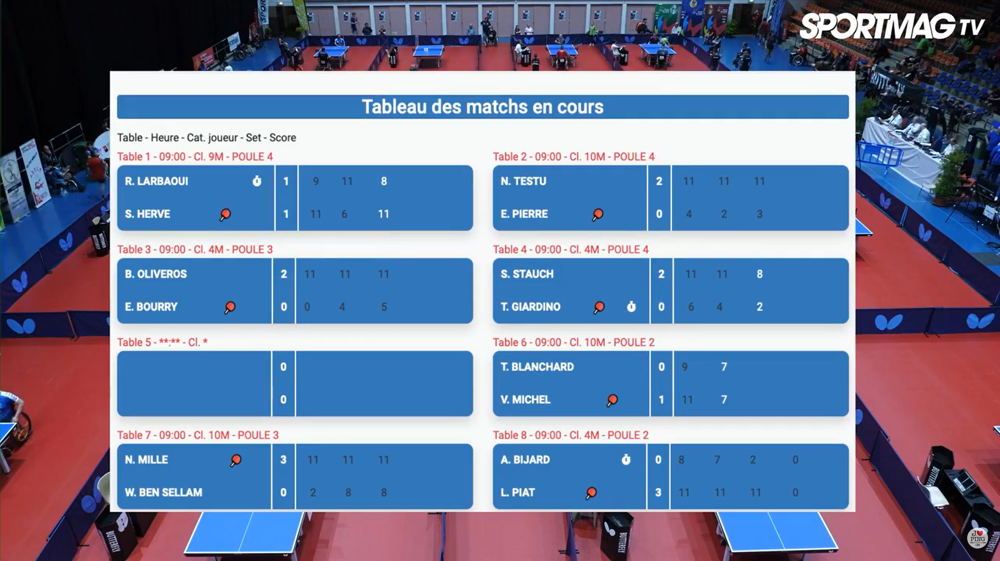
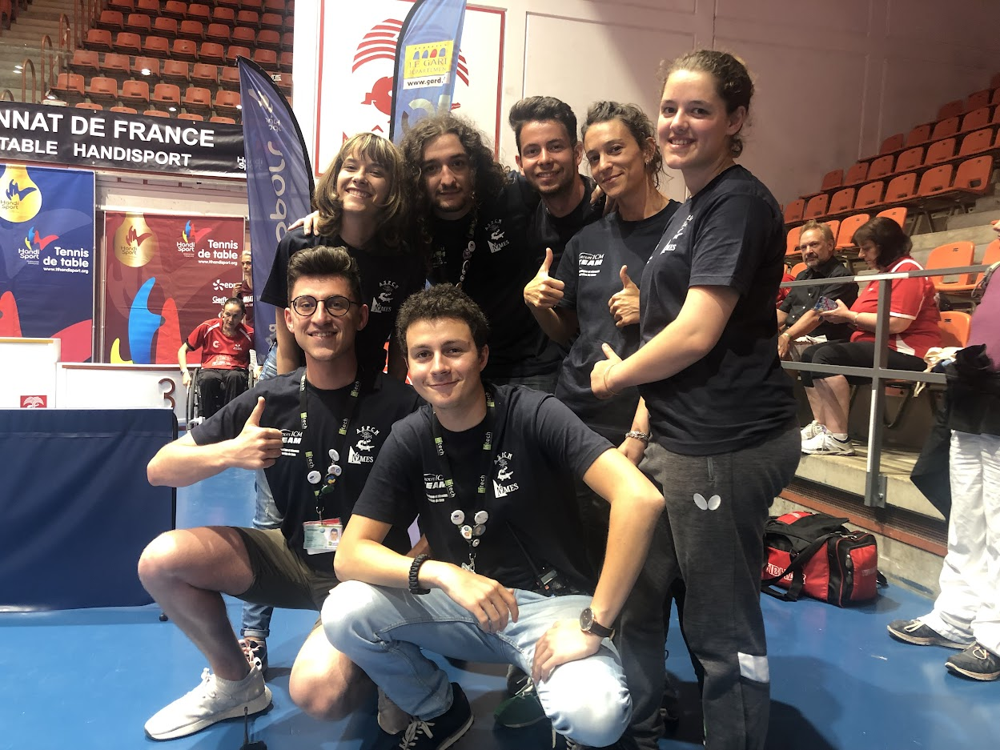
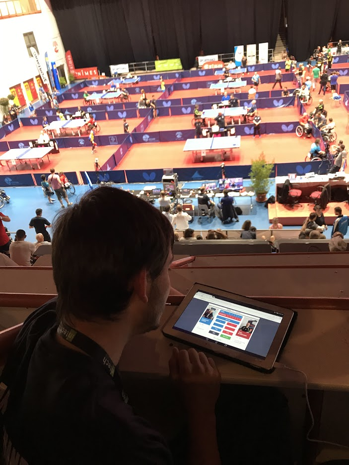

# PingScore

## Le contexte

PingScore est un projet informatique réalisé par Hugo MARTI et moi-même dans le cadre de notre formation en ingénierie
du logiciel à INTECH.

Le projet a été réalisé en partenariat avec l'[Association Perrier Cheminot Nîmois (ASPCN)](http://aspcn.fr/){:target="_blank"}, 
le principal club de tennis de table amateur et professionnel de la ville de Nîmes.

Notre mission était de développer une application de live-scoring pour permettre aux spectateurs de suivre en direct et
à distance
le [Championnat de France de Tennis de Table Handisport qui a eu lieu en juin 2019](http://tthandisport.org/2019/06/10/championnat-de-france-elite/){:target="_blank"}.

## Les objectifs

Pour mener à bien ce projet, plusieurs besoins ont été définis :

- Pouvoir afficher les scores des seize tables de jeu en même temps ou individuellement ;
- Avoir une gestion simple et rapide en amont et pendant la compétition ;
- Pouvoir afficher les scores en direct sur l'écran géant le jour de l'évènement ;
- Intégrer le flux vidéo en direct sur la ou les tables concernées ;
- Récolter des statistiques de consultation.

## Les étapes de réalisation

### Découverte du tennis de table

Avant de commencer le développement, et même après l'avant projet, nous avons eu l'occasion d'assister à des
entraînements et matchs de tennis de table afin de découvrir ce sport qui nous était jusqu'alors presque inconnu.

Nous avons pu apprendre les règles de comptage des points, de fautes et de temps morts, indispensables au bon
fonctionnement de notre future application.

Dans le même temps, nous avons pu rencontrer les athlètes de la section handisport qui nous ont expliqué comment étaient
partagés les compétiteurs en fonction de leur handicap. Nous avons également essayé d'échanger quelques balles avec eux
mais nous nous sommes vite fait battre.

### Développement en trois parties

Une fois bien à l'aise avec les règles de ce sport, nous étions prêts à développer. Nous avons divisé le travail en
trois parties : le visuel (front-end), la logique (back-end) et le direct (actualisation en temps réel des scores).

Nous avons travaillé le visuel de l'application pour ressembler au maximum à ce qui pouvait exister sur d'autres sites
web de consultation de scores et de paris en ligne. Un affichage des 16 tables de jeu de la compétition sous forme de
tableaux qui, lorsque l'on clique dessus, renvoie vers une page dédiée à la table avec plus de détails comme les photos
des joueurs en train de jouer et le flux vidéo en direct si disponible.

Il y avait également toute une partie pour l'administration de la compétition (création, saisie des joueurs, etc) et
pour la gestion des matchs (sous forme de télécommande).

Le visuel a été fait avec les technologies [HTML](https://developer.mozilla.org/fr/docs/Web/HTML){:target="_blank"}, [CSS](https://developer.mozilla.org/fr/docs/Web/CSS){:target="_blank"}
et [JavaScript](https://developer.mozilla.org/fr/docs/Learn/JavaScript/First_steps/What_is_JavaScript){:target="blank"}.

Afin de faire fonctionner de l'application, nous avons dû développer de zéro toute la logique en nous basant sur nos
nouvelles connaissances du tennis de table. Il fallait faire le lien avec la base de données que nous concevions au fil
du développement.

La logique a été construire grâce à la technologie [PHP](https://www.php.net/){:target="_blank"}.

Enfin, afin d'afficher les scores en direct sur l'écran géant lors de la compétition, mais aussi sur les téléphones,
tablettes et smartphone des personnes suivant les matchs à distance nous devions mettre en place un système
d'actualisation.

Pour cela, nous avons utilisé la technologie [Mercure](https://mercure.rocks/){:target="_blank"}, permettant d'envoyer
du contenu en temps réel depuis le serveur (et donc la base de données) vers des clients.

L'idée était d'avoir une interface pour tablette très simple d'utilisation pour les 'scoreurs' bénévoles qui devaient
saisir les scores des matchs.

### Test grandeur nature

Quelques jours avant le Championnat, nous avons eu accès au complexe sportif dans lequel se déroulerait la compétition.
Nous avons alors pu tester l'écran géant pour l'affichage des scores, la couverture wifi pour les tablettes servant au
marquage des scores et avons pu faire une première démo de la version définitive de l'application à une partie des membres
de l'association dont certains seraient présent au cours du week-end. Ces tests nous ont permis de corriger certains
aspects du design de l'application afin permettre une meilleure lisibilité sur écran géant et sur les appareils mobiles
sous la lumière artificielle de la grande salle.

Nous avons également été interviewé par le média numérique [Sport Mag](https://www.sportmag.fr/){:target="_blank"} qui a
fait un reportage sur la compétition. Vous pouvez retrouver un extrait de l'intervention de Hugo
MARTI [ici](https://www.youtube.com/watch?v=lkxKTyOwMAQ).

### Le championnat

Au cours du week-end de championnat, nous avons eu les rôles de formateur, coordinateur et support technique pour les '
scoreurs' bénévoles. Il nous fallait avant chaque phase de matchs, et ce, dès 8h du matin saisir les rencontres dans
l'application puis tenir à jour toutes les informations remontées par les utilisateurs et les 'scoreurs' tout en
corrigeant en live (en production) les quelques bugs qui pouvaient survenir. Ce fût l'occasion de mettre à l'épreuve
toutes les compétences techniques que nous avions acquit au cours des trois mois de développement.

    
_L'équipe qui a 'scoré' les matchs du Championnat de France 2019_
     

### Poursuite du projet

Le retour d'expérience du Championnat nous a permis de corriger l'application et d'apporter de nouveaux automatismes,
notamment dans l'import de joueurs ou la création de matchs.

Notre motivation sur le projet, le bon déroulé de la compétition ainsi que la démonstration que nous avons pu faire aux
responsables de la Fédération Française du Handisport (FFH) ont convaincu les commanditaires du projet, l'ASPCN, de
continuer le projet avec nous une fois la phase d'évaluation de l'école terminée.

## Les résultats présents et futurs

Après deux phases de développement additionnelles commandées par le club, et diverse utilisation au cours de rencontres
amicales ou compétitives, la version 1.4 de l'application n'avait plus rien à envier à celle utilisée pendant le
Championnat de France.

Malheureusement, la crise de la COVID-19 et les confinements successifs ont modifié les priorités du club et l'aventure
s'est arrêtée.

Ce projet à toutefois été source de nombreux apprentissages humains et techniques ou encore de bonnes pratiques qui nous
servent encore aujourd'hui.

## Compétences liées

- [Adapation](../../mes-compétences/Humaines/adaptation)
- [Analyse du besoin](../../mes-compétences/Humaines/analyse-du-besoin)
- [Communication](../../mes-compétences/Humaines/communication)
- [Conduite de formation](../../mes-compétences/Humaines/conduite-de-formation)
- [Gestion de projet Agile](../../mes-compétences/Techniques/gestion-de-projet-agile)
- [Déploiement automatisé](../../mes-compétences/Techniques/deploiement-automatise)
- [Planification](../../mes-compétences/Techniques/planification)
- [Docker](../../mes-compétences/Techniques/docker)
- [Développement de logiciel](../../mes-compétences/Techniques/developpement-logiciel)

 

