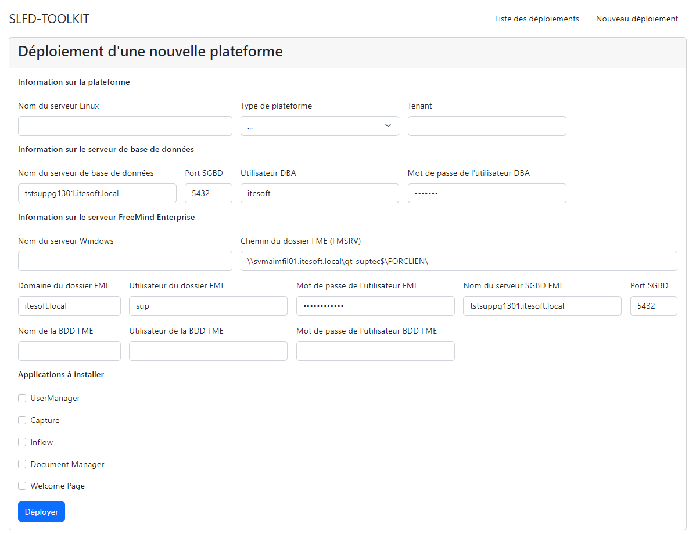

# Toolkit-Delivery

## Le contexte
Lors de mon arrivée en stage à iTESOFT, j'ai suivi des formations sur l'installation et l'utilisation des applications développées par l'entreprise. Durant cette période, j'ai constaté qu'il fallait environ trois jours et des dizaines des fichiers à éditer à une multitude d'endroits pour mettre en place une plateforme de développement complète fonctionnelle.

Pour chaque nouveau projet client, les ingénieurs projet répétés ces étapes fastidieuses et chronophages non sans mal car le risque d'oubli et d'erreur était assez élevé.

Après en avoir discuté avec mon manager, j'ai décidé de créer un outil qui permettrait d'installer une plateforme complète en moins de 30 minutes. 

Cet outil devait être simple d'utilisation et permettre de réduire le temps de mise en place d'une plateforme.

## Les étapes de réalisation
La première étape a été de définir le périmètre du projet. L'idée était d'avoir un outil simple et fonctionnel rapidement. Après quelques échanges avec mon manager, nous avons décidé de concentrer le projet sur une seule solution en ciblant uniquement les cas d'utilisation du département "projet" qui s'occupe de paramétrer les solutions en fonction des besoins des clients puis de les déployer sur les serveurs clients.

La solution choisie se décompose en deux parties :

- 1 serveur Windows où sont déployés des applications historiques en client lourd.
- 1 serveur Linux où sont déployés des applications plus récentes _dockerisées_.

J'ai ensuite passé beaucoup de temps à analysé les différentes étapes de la mise en place d'une plateforme et à identifier l'ensemble des paramètres.

J'ai ensuite créé un diagramme de Gantt pour planifier et définir les différentes étapes de réalisation du projet durant ma période de stage.

Une fois le projet validé, j'ai commencé à travailler sur l'interface graphique qui permettra à l'utilisateur de saisir les paramètres. J'ai choisi de créer une interface web en utilisant le framework [Angular](https://angular.io/){:target="_blank"} accompagné d'une [API](../mes-compétences/Techniques/api.md) Java [Spring Boot](https://spring.io/){:target="_blank"} qui est ensuite chargé d'exécuter les différentes actions.

L'API est chargée de récupérer les paramètres saisis par l'utilisateur, de les valider, de créer un fichier de configuration et ensuite de lancer les scripts d'installation sur les différentes machines.

J'ai créé un script Powershell pour la partie Windows et un script Bash pour la partie Linux qui permettent de télécharger et d'installer les applications nécessaires.

## Les résultats présents et futurs
Après plusieurs mois de développements et de tests, à la fin de mon stage l'outil était fonctionnel et utilisé par les ingénieurs projet pour déployer les plateformes de nouveaux projets.

Durant mon alternance, des stagiaires ont été embauchés pour travailler sur le projet, mais je suis resté en charge du projet.

Je me suis donc occupé de recenser les différentes demandes d'évolutions et de corrections des utilisateurs. J'ai ensuite planifié chaque demande et j'ai travaillé avec l'équipe sur leur réalisation.

L'outil a intéressé les autres départements de l'entreprise et il est maintenant intégré directement à une partie des solutions. Il sert pour déployer des plateformes de développement, de test et de production en interne.

## Compétences liées
- [Adapation](../../mes-compétences/Humaines/adaptation)
- [Conduite de formation](../../mes-compétences/Humaines/conduite-de-formation)
- [API](../../mes-compétences/Techniques/api)
- [Déploiement automatisé](../../mes-compétences/Techniques/deploiement-automatise)
- [Docker](../../mes-compétences/Techniques/docker)
- [Développement de logiciel](../../mes-compétences/Techniques/developpement-logiciel)
