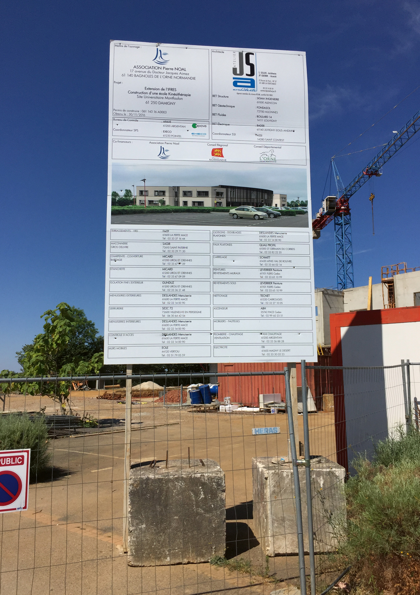
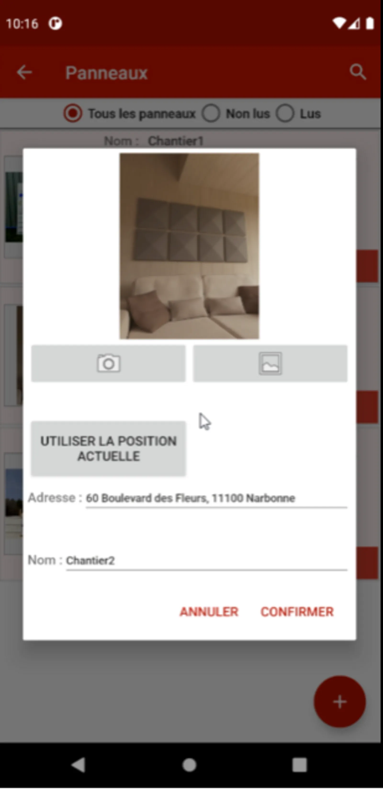

# WorkBoard

Le projet WORKBOARD a été initié dans le cadre d'un projet étudiant avec mes camarades Valentin MAILHAN, Clément RINGEVAL et Adam AMBROSINO en partenariat avec Würth France. Cette application mobile avait pour objectif de faciliter la collecte d'informations pour les commerciaux en déplacement grâce à une prise de photo des panneaux de chantiers.

## Le contexte
La branche française de la multinationale Würth avait du mal à synchroniser les informations collectées par les commerciaux. Afin de centraliser efficacement toutes ces informations, nous avons proposé une application mobile pour simplifier la collecte des données.

## Les objectifs
- Prendre des photos géolocalisées de panneaux de chantiers ;
- Créer et éditer des fiches entreprises depuis un panneau et les enregistrer dans une base de données locale ;
- Synchroniser la base de données locale avec une base de données en ligne.

## Les étapes de réalisation
Dans notre projet, nous avons commencé par établir les besoins du client et rédigé un cahier des charges détaillé. 
Cependant, tout au long du projet, nous avons dû faire face à plusieurs révisions, car certaines des demandes du 
client, telles que l'intelligence artificielle, le big data et la blockchain, étaient trop complexes à mettre en 
œuvre dans le temps imparti.

Une fois que le projet a été approuvé, nous avons commencé à poser la structure de notre application en utilisant Java Android et en reliant une API en PHP pour gérer les opérations CRUD sur la base de données.

Le développement a commencé par la création d'une page d'accueil avec un design graphique imaginé pour valider rapidement ce point avant de passer aux aspects plus techniques.

Nous avons ensuite ajouté la fonctionnalité permettant d'enregistrer un panneau de chantier en saisissant des informations textuelles et en prenant une photo depuis l'application ou la galerie. Nous avons également ajouté un bouton pour récupérer les coordonnées GPS du téléphone afin de déduire automatiquement l'adresse du panneau.

Ensuite, nous avons ajouté une page pour enregistrer des entreprises et des contacts, ce qui nous a amenés à réfléchir sur la manière la plus ergonomique d'afficher l'image du panneau tout en saisissant les informations. Nous avons finalement réussi à rendre la page utilisable et pratique pour les utilisateurs.

La dernière étape consistait à permettre l'ajout de plusieurs entreprises à chaque panneau de chantier et à relier des panneaux à des entreprises déjà insérées.

En tant que responsable de la cohérence du code, j'ai veillé à ce que le code reste semblable au reste de la codebase sans en changer le fonctionnement. J'ai également développé la fonctionnalité permettant de récupérer des images de panneau depuis la galerie et je me suis occupé de la liaison entre les panneaux de chantier et les entreprises.

Enfin, nous avons ajouté un bouton de synchronisation sur la page d'accueil pour rassembler les informations de différents commerciaux et avons amélioré l'expérience utilisateur en proposant une traduction dans plusieurs langues, un thème clair/sombre et un filtre d'affichage des données.

Après toutes ces étapes, nous avons réussi à finaliser le projet, en répondant aux besoins du client de manière efficace et en offrant une expérience utilisateur fluide et pratique. Cela a été une expérience enrichissante qui a renforcé notre maîtrise de la planification et du développement logiciel.
## Les acteurs principaux
Mon rôle dans ce projet était celui de Scrum master et développeur d'API, Adam AMBROSINO était en charge du développement mobile, Valentin MAILHAN également, et Clément RINGEVAL était designer et testeur. Stephen Conord était le product owner chez Würth France.

## Les résultats présents et futurs
Pour notre équipe, ce projet a été une véritable opportunité d'apprendre une nouvelle technologie et de développer de nouvelles compétences. Pour Würth France, c'était une bonne occasion de lancer l'idée d'une application interne qui faciliterait la collecte d'informations pour les commerciaux.

Bien que le projet n'ait pas été mis en production pour de vrais utilisateurs, nous sommes fiers du travail accompli. Nous aurions cependant pu améliorer certains aspects de l'application, notamment en utilisant Kotlin au lieu de Java, en stockant des miniatures d'images pour accélérer le chargement, en utilisant un moyen d'authentification tel que Google Authenticator, ou encore en appelant régulièrement le Garbage Collector pour améliorer les performances et éviter les fuites de mémoire.

Bien que ce ne soit pas le projet le plus abouti que j'ai pu réaliser, j'ai beaucoup apprécié travailler sur cette application mobile. Cela m'a permis d'acquérir de nouvelles compétences et de découvrir le développement d'applications natives pour smartphones.

En conclusion, le projet WORKBOARD a été une expérience enrichissante pour moi et mes collègues, nous avons travaillé sur une technologie nouvelle et appris de nouvelles compétences dans un contexte réel d'entreprise. Si nous avions pu poursuivre le projet, nous aurions certainement pu améliorer l'application et la rendre plus fonctionnelle pour les commerciaux de Würth

## Compétences liées
- [Analyse du besoin](../../mes-compétences/Humaines/analyse-du-besoin)
- [Communication](../../mes-compétences/Humaines/communication)
- [API](../../mes-compétences/Techniques/api)
- [Développement de logiciel](../../mes-compétences/Techniques/developpement-logiciel)
- [Gestion de projet Agile](../../mes-compétences/Techniques/gestion-de-projet-agile)
- [Planification](../../mes-compétences/Techniques/planification)
